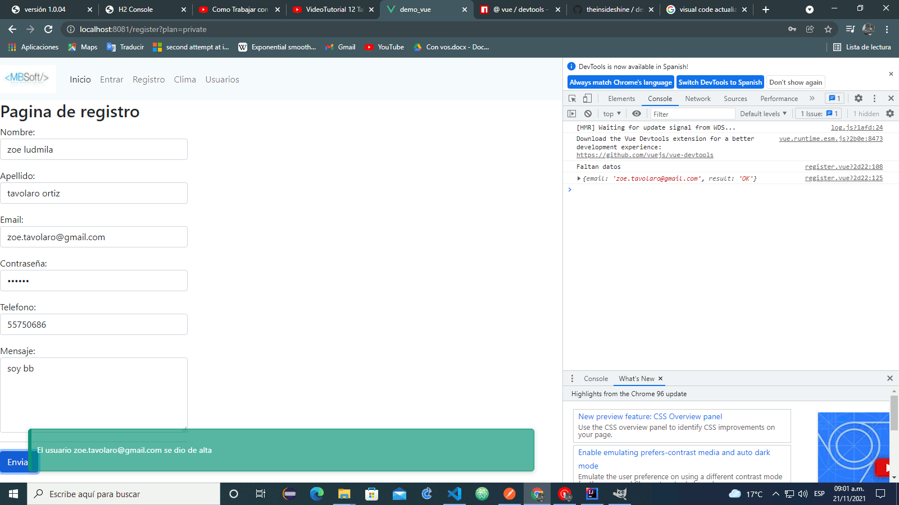
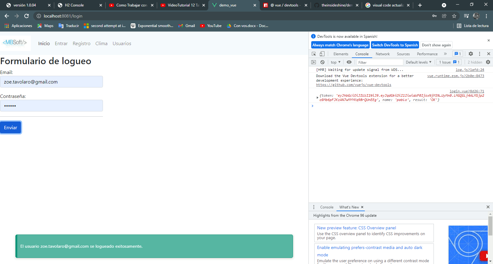
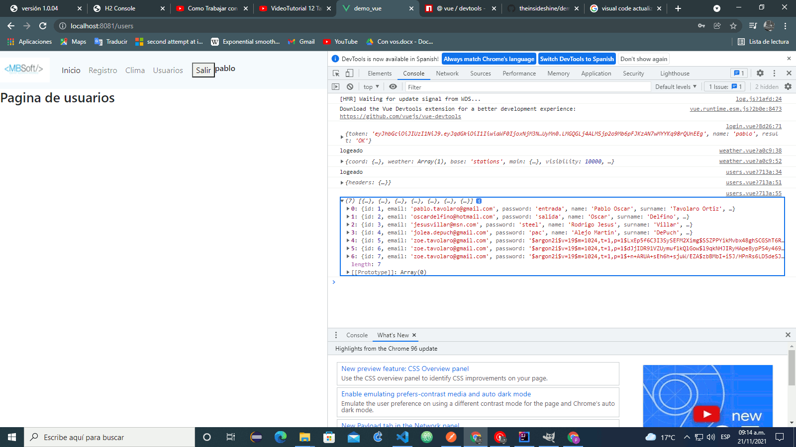
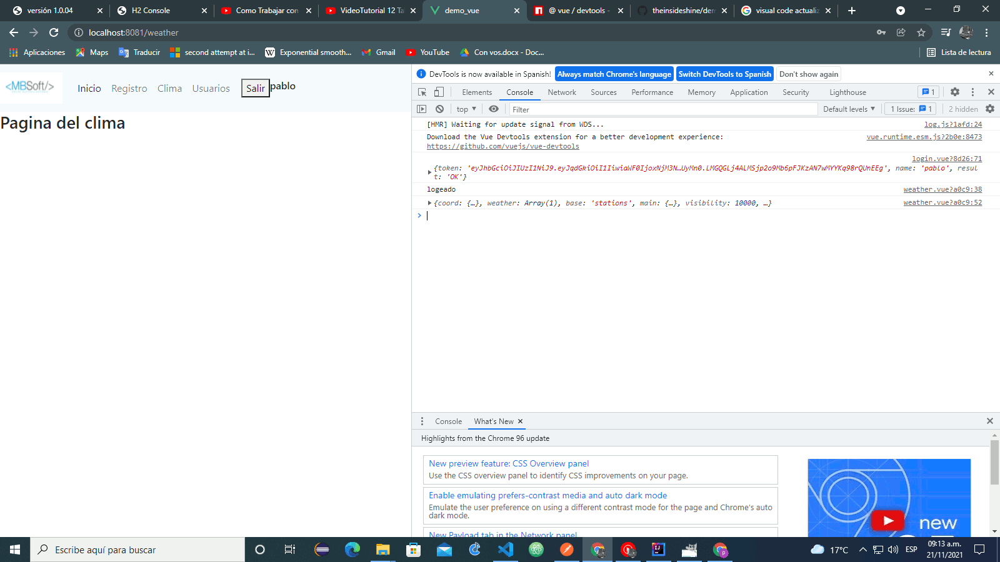
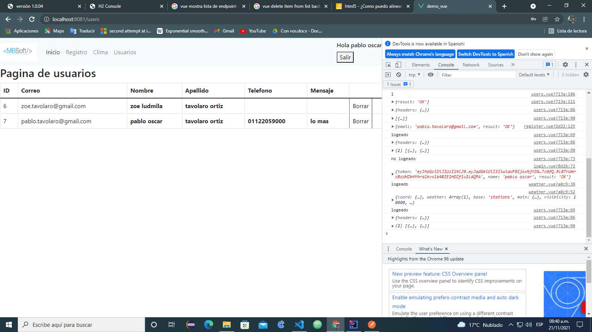
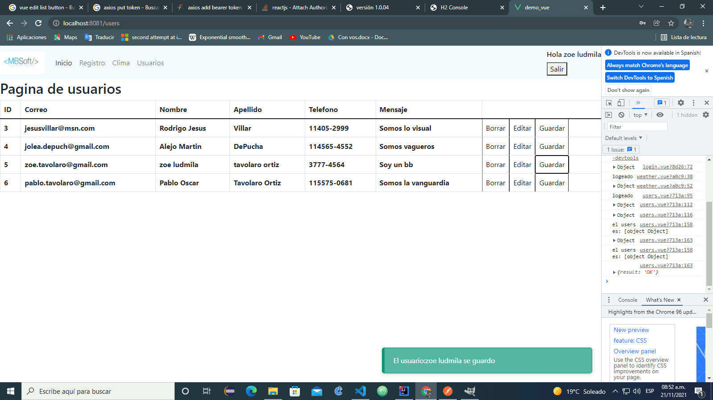

# demo_vue

## Project setup
```
npm install -g @vue/cli
Vue --version 

npm install --save vue-router 

npm install --save axios


npm install --save vuelidate


npm i @smartweb/vue-flash-message


```

### Compiles and hot-reloads for development
```
npm run serve
```

### Compiles and minifies for production
```
npm run build
```

### Lints and fixes files
```
npm run lint
```

### Customize configuration
See [Configuration Reference](https://cli.vuejs.org/config/).


La intencion de esta app es poder probar un back end escrito en java con toker jwt y Argon2
para un crud y un acceso a und end point del clima.

Alta de usuario


Login


Listado de usuarios


Acceso a end point



Listar y borrar usuarios


Editar usuarios



