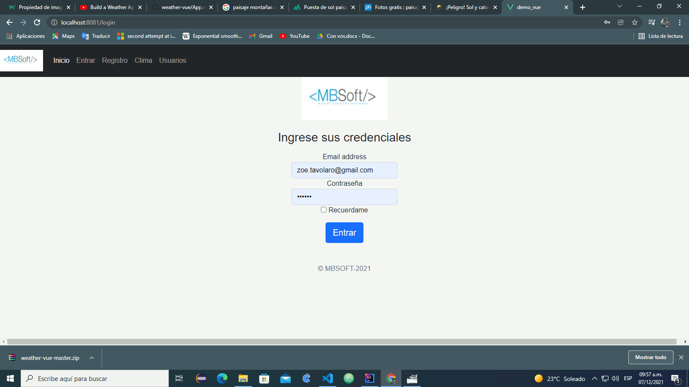

# demo_vue

## Project setup
```
npm install -g @vue/cli
Vue --version 

npm install -

```

### Compiles and hot-reloads for development
```
npm run serve
```

### Compiles and minifies for production
```
npm run build
```

### Lints and fixes files
```
npm run lint
```

### Customize configuration
See [Configuration Reference](https://cli.vuejs.org/config/).


La intencion de este proyecto es poder probar en un servidor la autenticacion con token-jwt y un crud
 en una base de datos H2 con Argon2 ,ademas un acceso a und end point del clima.
 
 A continuacion se muestran la evolucion del proyecto

Alta de usuario


Login


Listado de usuarios


Acceso a end point


Listar y borrar usuarios


Editar usuarios


Se mejoro en un primera aproximacion la estetica de las pantallas.

Inicio


Loggeo



Registrar


Usuarios


Clima frio


Clima Calido


[](https://youtu.be/GJMszumuEZE)

